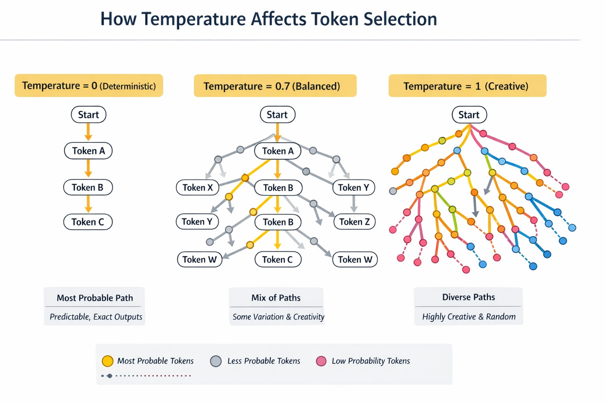

## What Changes Output

| Parameter      | Effect            | Why                     |
| -------------- | ----------------- | ----------------------- |
| temperature    | randomness        | controls sampling       |
| top_p          | diversity         | limits probability mass |
| max_tokens     | length            | output cutoff           |
| system prompt  | behavior          | instruction priority    |
| context length | memory            | truncation              |
| stop sequence  | termination       | early stop              |
| model          | reasoning quality | architecture            |
| prompt clarity | accuracy          | ambiguity reduction     |

## Temperature Effects on Output

Based on Groq API responses across different prompts:

### Temperature 0 (Deterministic)
- **Output Characteristics**: Consistent, structured, factual, minimal variation
- **Why**: Uses greedy sampling (highest probability tokens), reduces randomness
- **Best For**: Code generation, factual answers, APIs
- **Example**: "Explain LLM in one sentence" → Standard definition without embellishment

### Temperature 0.7 (Balanced Creativity)
- **Output Characteristics**: Varied phrasing, moderate creativity, maintains coherence
- **Why**: Allows some randomness while keeping high-probability tokens dominant
- **Best For**: Writing, explanations, balanced ideation
- **Example**: "Write a Python function" → Includes examples and alternatives, more descriptive

### Temperature 1 (High Creativity)
- **Output Characteristics**: Highly varied, creative, sometimes incomplete or tangential
- **Why**: Equal probability weighting, maximum randomness in token selection
- **Best For**: Brainstorming, stories, diverse ideas
- **Example**: "Give 3 reasons microservices fail" → More elaborate explanations, additional context

### Observed Patterns
- **Code Tasks**: Temp 0 produces clean, complete functions; higher temps add more comments/examples
- **Explanations**: Temp 0 is concise; higher temps provide richer context
- **Creative Tasks**: Higher temps generate more unique, varied responses
- **Structured Output**: Temp 0 better for JSON/structured data; higher temps may introduce inconsistencies

## Visual Guide



Deterministic Settings (Production APIs)
```
temperature = 0
top_p = 1
```

Used for:
- APIs
- JSON
- automation
- validation


Creative Settings
```
temperature = 0.7–1
top_p = 0.9
```

Used for:
- brainstorming
- writing
- ideation